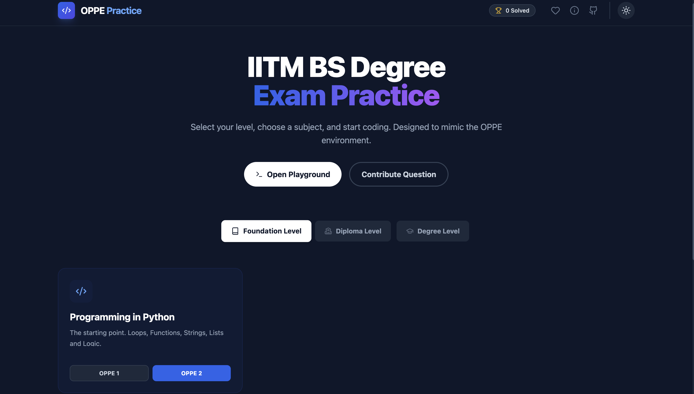
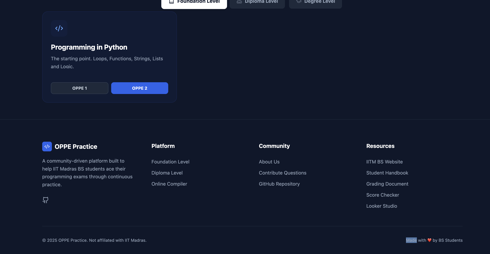
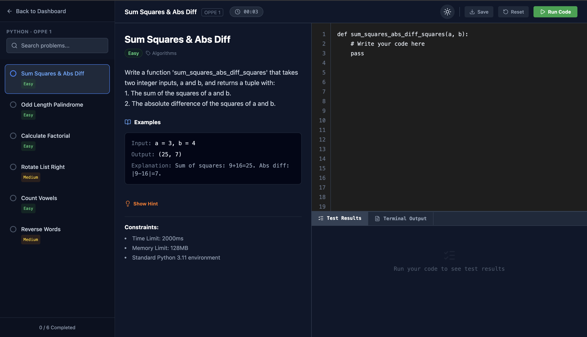
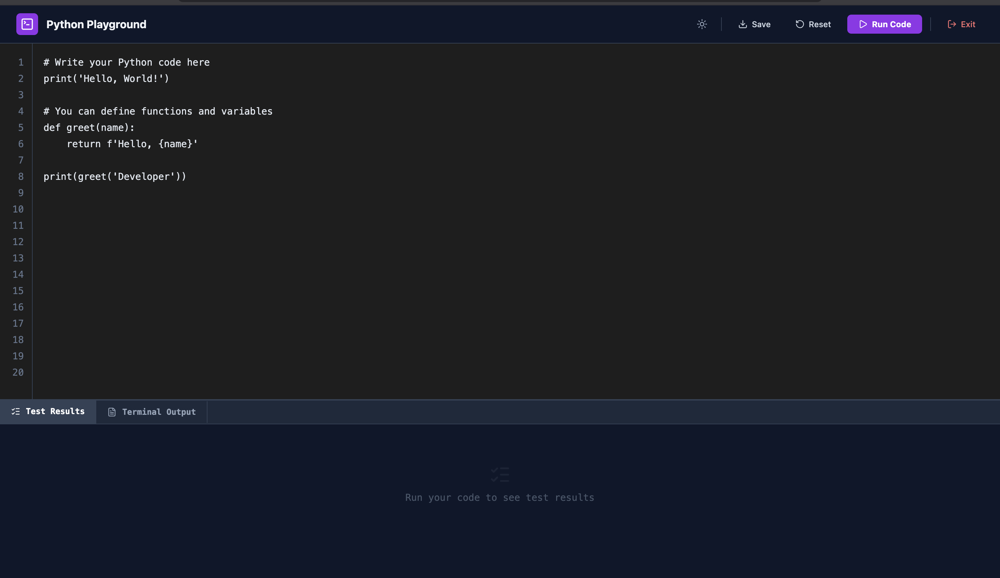

<div align="center">

# 🎯 OPPE Practice Platform

### *Master Your IITM BS Degree OPPE Exams with Confidence*

[](https://oppe-practice.pages.dev/)
[](LICENSE)
[](https://react.dev/)
[](https://www.typescriptlang.org/)
[](https://vitejs.dev/)

**The ultimate practice companion for IITM BS Degree students** — featuring an in-browser Python IDE, curated problems, instant feedback, and progress tracking.

[**🚀 Try it Live**](https://oppe-practice.pages.dev/) · [**📝 Report Bug**](https://github.com/yourusername/oppe-practice/issues) · [**✨ Request Feature**](https://github.com/yourusername/oppe-practice/issues)

</div>

---

## ✨ Features

<table>
<tr>
<td width="50%">

### 🎓 **Comprehensive Coverage**
- **Python Programming** — Fundamentals to Advanced
- **Data Structures & Algorithms** — Trees, Graphs, Dynamic Programming
- **Machine Learning** — Classification, Regression, Neural Networks
- **OPPE1 & OPPE2 Levels** — Tailored problem sets for each exam

</td>
<td width="50%">

### 🔧 **Powerful IDE**
- **In-Browser Python Execution** — Powered by Pyodide
- **Real-time Test Cases** — Instant feedback on your solutions
- **Code Editor** — Syntax highlighting & auto-completion
- **Progress Tracking** — See your solved problems at a glance

</td>
</tr>
<tr>
<td width="50%">

### 🎨 **Modern Interface**
- **Dark/Light Theme** — Easy on the eyes, day or night
- **Responsive Design** — Works on desktop, tablet, and mobile
- **Confetti Celebrations** — Celebrate when you solve problems! 🎉
- **Timer** — Track how long you spend on each problem

</td>
<td width="50%">

### 🚀 **Developer Experience**
- **Fast Build Tool** — Powered by Vite for instant HMR
- **TypeScript** — Type-safe codebase
- **Component Architecture** — Clean, modular, maintainable
- **Local Storage** — Your progress persists across sessions

</td>
</tr>
</table>

---

## 📸 Screenshots

<details open>
<summary><b>🏠 Home Dashboard</b></summary>
<br>



*Choose your subject and exam level to get started*

</details>

<details>
<summary><b>📊 Practice Dashboard</b></summary>
<br>



*Track your progress and solved problems*

</details>

<details>
<summary><b>ℹ️ About Page</b></summary>
<br>


*Learn more about the platform*

</details>

<details>
<summary><b>💻 IDE - Problem Solving</b></summary>
<br>



*Work through problems with instant feedback*

</details>

<details>
<summary><b>⚡ Code Editor</b></summary>
<br>



*Full-featured Python IDE in your browser*

</details>

---

## 🚀 Quick Start

### Prerequisites

- **Node.js** (v16 or higher)
- **npm** or **yarn**

### Installation

```bash
# Clone the repository
git clone https://github.com/yourusername/oppe-practice.git

# Navigate to the project directory
cd oppe-practice

# Install dependencies
npm install

# Start the development server
npm run dev
```

The app will be available at `http://localhost:5173` 🎉

### Build for Production

```bash
# Create an optimized production build
npm run build

# Preview the production build locally
npm run preview
```

---

## 🏗️ Tech Stack

| Technology | Purpose |
|------------|---------|
|  | UI Framework |
|  | Type Safety |
|  | Build Tool & Dev Server |
|  | In-Browser Python Runtime |
|  | Icon Library |
|  | Styling (via inline classes) |

---

## 📂 Project Structure

```
oppe-practice/
├── components/          # React components
│   ├── About.tsx       # About page
│   ├── CodeEditor.tsx  # Monaco-like code editor
│   ├── Console.tsx     # Test results & output
│   ├── Contribute.tsx  # Contribution guide
│   ├── Home.tsx        # Landing page
│   ├── Playground.tsx  # Free-form coding playground
│   ├── ProblemDetail.tsx # Problem description viewer
│   └── Sidebar.tsx     # Problem navigation
├── data/
│   └── problems.ts     # Problem bank (curated questions)
├── services/
│   └── pythonRuntime.ts # Pyodide initialization & execution
├── public/             # Static assets (screenshots, etc.)
├── App.tsx             # Main application component
├── index.tsx           # Entry point
├── types.ts            # TypeScript type definitions
└── vite.config.ts      # Vite configuration
```

---

## 🎯 How It Works

### 1️⃣ **Choose Your Path**
Select a subject (Python, DSA, ML) and exam level (OPPE1 or OPPE2) from the home page.

### 2️⃣ **Solve Problems**
Work through curated problems in the in-browser IDE with:
- Pre-written starter code
- Detailed problem descriptions
- Sample inputs/outputs
- Real-time test case validation

### 3️⃣ **Track Progress**
- ✅ Solved problems are marked with a checkmark
- ⏱️ Timer tracks how long you spend on each problem
- 💾 Progress is saved locally to your browser
- 🎉 Celebrate your wins with confetti animations!

### 4️⃣ **Download & Save**
Export your solutions as `.py` files to review later or submit.

---

## 🤝 Contributing

We welcome contributions from the community! Whether it's bug fixes, new features, or additional problems, your help is appreciated.

### How to Contribute

1. **Fork the repository**
2. **Create a feature branch** (`git checkout -b feature/AmazingFeature`)
3. **Commit your changes** (`git commit -m 'Add some AmazingFeature'`)
4. **Push to the branch** (`git push origin feature/AmazingFeature`)
5. **Open a Pull Request**

### Adding New Problems

Problems are stored in `data/problems.ts`. To add a new problem:

```typescript
{
  id: 'unique-id',
  title: 'Problem Title',
  subject: Subject.PYTHON, // or DSA, ML
  examLevel: ExamLevel.OPPE1, // or OPPE2
  difficulty: 'Easy', // Easy, Medium, Hard
  description: '# Problem statement here...',
  examples: [
    { input: 'example input', output: 'expected output' }
  ],
  starterCode: 'def your_function():\n    pass',
  functionName: 'your_function',
  testCases: [
    { input: [test1_input], expected: expected_output },
    // ... more test cases
  ]
}
```

---

## 📜 License

This project is licensed under the **MIT License** — see the [LICENSE](LICENSE) file for details.

---

## 🌟 Acknowledgments

- **IITM BS Degree Community** — For inspiring this project
- **Pyodide Team** — For making Python run in the browser
- **React & Vite Teams** — For amazing developer tools
- **You!** — For using and contributing to this platform

---

## 💬 Support

If you find this project helpful, please give it a ⭐ on GitHub! It helps others discover it.

Have questions or suggestions? Feel free to [open an issue](https://github.com/yourusername/oppe-practice/issues).

---

<div align="center">

**Made with ❤️ by IITM students, for IITM students**

[](https://github.com/yourusername/oppe-practice)

</div>
